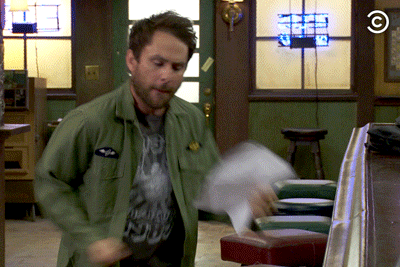
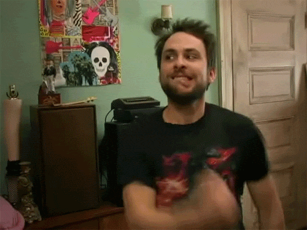

# docsify-gifcontrol

A Docsify plugin that adds customizable player controls to GIFs. GIFs will play on hover or on click depending on your [configuration](options.md).

## Quick Start

Add the CSS file to the top of your Docsify index.html
```html
<link rel="stylesheet" href="//unpkg.com/docsify-gifcontrol/dist/docsify-gifcontrol.css">
```

Add the JavaScript file below your Docsify script tag
```html
<script src="//unpkg.com/docsify-gifcontrol/dist/docsify-gifcontrol.js"></script>
```

Add a GIF in your markdown
```markdown

```

## Examples

#### Hover to play (default)

  

```markdown
<!-- Hover to play, unhover to pause (default) -->

```

#### Click to play

 

```markdown
<!-- Click to play, click again to pause (using inline option) -->

```

#### Customization

You can customize almost everything about the player. For more information see [the Configuration section](options.md).

; -gifcontrol-playIcon=<svg xmlns=\"http://www.w3.org/2000/svg\" viewBox=\"0 0 512 512\"><path d=\"M462.3 62.6C407.5 15.9 326 24.3 275.7 76.2L256 96.5l-19.7-20.3C186.1 24.3 104.5 15.9 49.7 62.6c-62.8 53.6-66.1 149.8-9.9 207.9l193.5 199.8c12.5 12.9 32.8 12.9 45.3 0l193.5-199.8c56.3-58.1 53-154.3-9.8-207.9z\"/></svg>;")

```markdown
<!-- Customize colors and icons -->
; -gifcontrol-playIcon=<svg xmlns=\"http://www.w3.org/2000/svg\" viewBox=\"0 0 512 512\"><path d=\"M462.3 62.6C407.5 15.9 326 24.3 275.7 76.2L256 96.5l-19.7-20.3C186.1 24.3 104.5 15.9 49.7 62.6c-62.8 53.6-66.1 149.8-9.9 207.9l193.5 199.8c12.5 12.9 32.8 12.9 45.3 0l193.5-199.8c56.3-58.1 53-154.3-9.8-207.9z\"/></svg>;")
```
#### Additional customization

More customization examples can be found in the [Configuration](options.md) section. You can also check out the source of this documentation in the [docs](https://github.com/gbodigital/docsify-gifcontrol/tree/master/docs) folder on Github.

## Excluding Images

By default all GIFs in image tags will be parsed to use the player overlay unless they fall in to one of the four categories below:

- Image tags with the `.emoji` class are ignored
- Image tags with a `data-gifcontrol-disabled` attribute are ignored
- Image tags that do not contain the `.gif` string in their `src` attribute are ignored
- Images created with markdown that have the `-gifcontrol-disabled;` option in the title component of the image markdown are ignored

#### Example

 

```markdown
<!-- The plugin will ignore the gif below -->

```

## Attributions

- [omggif](https://github.com/deanm/omggif) written by Dean McNamee under [MIT License](https://opensource.org/licenses/MIT) is used to load GIF file data 
- A customized version of [gifler](https://github.com/themadcreator/gifler) written by Bill Dwyer under [Apache 2.0 License](https://opensource.org/licenses/Apache-2.0) is used to render GIFs to an HTML canvas element
- The SVG icons used in the code and documentation are from the [FontAwesome Free Icon Pack](https://fontawesome.com) licensed under the [Creative Commons 4.0 BY License](https://creativecommons.org/licenses/by/4.0/)